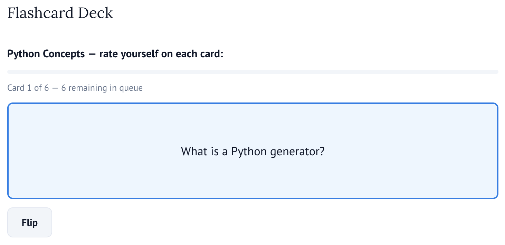

# Formative Assessment Widgets

*Interactive formative assessment widgets for Marimo computational notebooks using AnyWidget.*

## Overview

### `ConceptMapWidget`: connect concepts with relationships


### `FlashcardWidget`: check understanding with flash cards



### `LabelingWidget`: add labels to items


### `MatchingWidget`: match items from Column A to items from Column B


### `MultipleChoiceWidget`: answer a question with multiple options


### `OrderingWidget`: arrange items in the correct sequence


## Try the Example

```bash
marimo run demo.py
```

This will open an interactive notebook showcasing all widget types.
